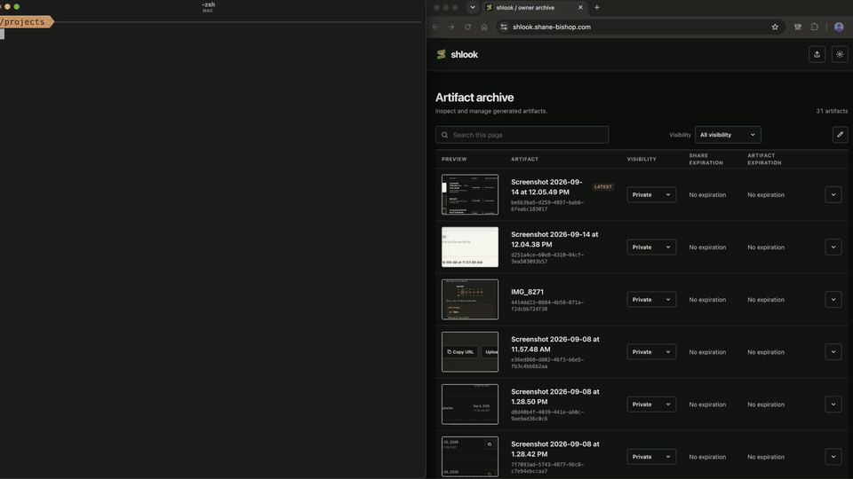

# shlook

[](https://www.npmjs.com/package/shlook)
[](https://github.com/shanebishop1/shlook/actions/workflows/ci.yml)

`shlook` lets you and your coding agent share HTML pages, static sites, and images through a
private-by-default library hosted in your Cloudflare account.

- **Working over SSH:** have your agent publish a page or image and open its link, without copying
  files back or exposing a development server for each preview.
- **Reviewing on your phone:** open the artifact, then upload a screenshot through the mobile web
  app for your agent to retrieve and inspect. The same library works in both directions.

Use the web app on any device with a modern browser. Any coding agent that can run CLI commands
can use shlook; the included skill documents the workflow, without tying it to one agent app.

Set it up once using the included agent skill and deployment recipe. With a Cloudflare account
and a Cloudflare-managed domain, the agent provisions storage and access controls after your
approval; you do not need to configure R2 yourself.



## Quick start

Install the skill for your coding agent:

```bash
npx skills add shanebishop1/shlook
```

Then paste this prompt into your agent (restart it first if needed to load the new skill):

```text
Use the `shlook` skill to help me install and set up the `shlook` CLI/deployment
(https://github.com/shanebishop1/shlook). Follow the skill's setup/references,
check prerequisites, and handle the CLI installation and deployment.
Ask me if you are missing any credentials, domain, or owner-email details,
and guide me through securely providing a temporary provisioning token without
pasting secrets into chat. Never directly read any sensitive credentials.
Show me the deployment plan and get my approval before applying it.
Verify the connection when finished, keep publications private by default,
and tell me how to publish my first artifact.
```

For direct CLI setup and credential details, see the
[setup reference](skills/shlook/references/setup.md).

## Alternatives

- **SCP or [croc](https://github.com/schollz/croc):** useful for file transfer. SCP needs an
  SSH-accessible destination; croc needs a receiving client. Shlook gives you a saved viewing link
  instead of requiring a transfer to each device.
- **[Tailscale Serve](https://tailscale.com/kb/1312/serve):** can serve static artifacts, especially
  if you already use Tailscale. Configuring serving and tailnet access just to view a quick artifact
  can be more effort than needed; shlook uses the same preconfigured publishing workflow each time.
- **[Zipline](https://github.com/diced/zipline) or [Chibisafe](https://github.com/chibisafe/chibisafe):**
  broader screenshot and file-hosting tools. Shlook focuses on private-by-default HTML/image exchange
  with an agent skill and an automated Cloudflare deployment recipe.

## Limits

| Limit                         | Value                     |
| ----------------------------- | ------------------------- |
| Maximum file size             | 25 MiB                    |
| Maximum publication size      | 100 MiB                   |
| Maximum files per publication | 500                       |
| Abandoned upload cleanup      | 24 hours without progress |

## Publish an artifact

Every new publication has a concise display name and may have a description:

```bash
shlook publish ./artifact \
  --name "Owner archive refinement" \
  --description "Responsive archive controls and theme study" \
  --json
```

Names accept 1-80 characters; descriptions accept up to 500. Both are stored in D1, returned by
the owner API, and shown and searched in the owner archive. Publication defaults to private.
`shlook publish --json` returns `data.url` as the authenticated private viewing URL, not a public
or secret-link URL. Static bundles should use relative asset URLs such as `./app.js` and
`./styles.css`, not root-relative `/assets/...` URLs.

The creation API accepts the same metadata as JSON:

```json
{
  "name": "Owner archive refinement",
  "description": "Responsive archive controls and theme study"
}
```

For command grammar, JSON behavior, and environment-profile rules, see the
[commands reference](skills/shlook/references/commands.md).

## Documentation

- [Setup](skills/shlook/references/setup.md)
- [Commands](skills/shlook/references/commands.md)
- [Security model and routes](docs/security-model.md)
- [Verification](skills/shlook/references/verification.md)
- [Development](docs/development.md)

## License

MIT. See [`LICENSE`](LICENSE).
